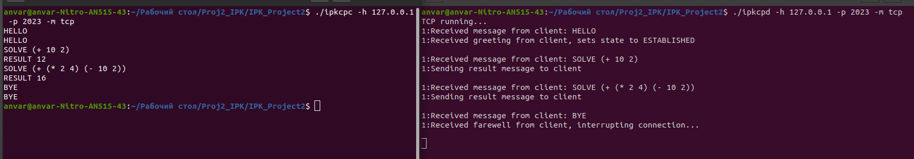
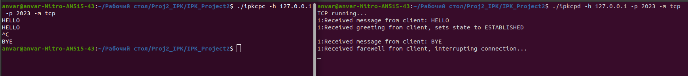
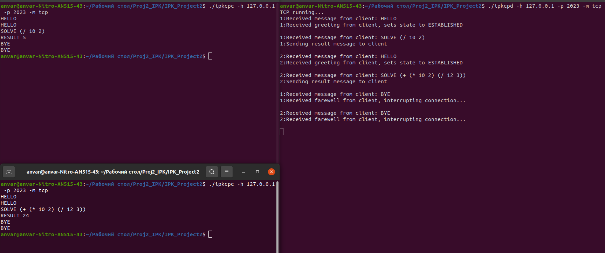
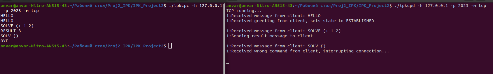
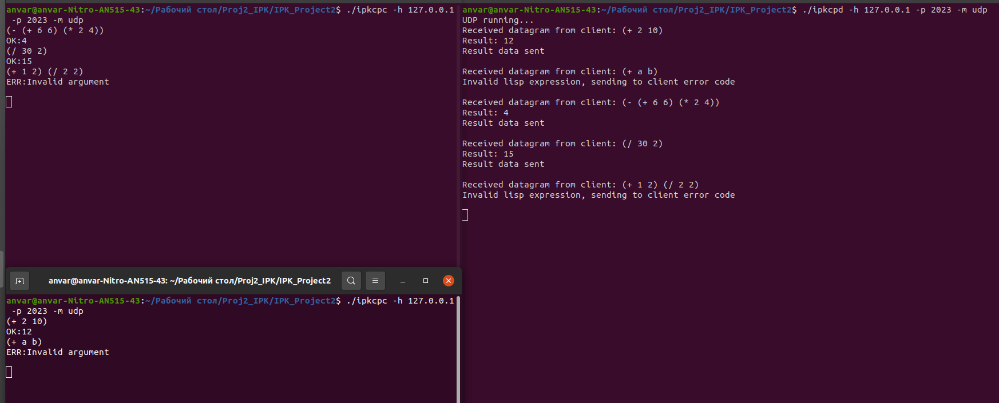

# IPK Project 2 - IOTA: Server for Remote Calculator

**Author**: Anvar Kilybayev\
**Login**: xkilyb00\
**Language**: English
**Supported OS**: Linux\
**Gitea**: [xkilyb00](https://git.fit.vutbr.cz/xkilyb00/IPK_Project2)

<TODO list>

## Description
This is C++ implementation of server that's receiving and sending data from remote calculator. Using either TCP or UDP protocol. The program receiving mathematical expressions, compute them then sends back results to client.

The server accepts binary/textual input depending on selected mode UDP/TCP. It is able to handle more than one client at the same time. 

In order to communicate with many clients at the same time, server using miltithreading with fork() function.

## Prerequisites

Required **g++** and **make** installed.

## Build
```console
$ make
```
## Usage
```console
$ ./ipkcpd -h <host> -p <port> -m <mode>
```
### Command-line arguments
| Argument | Description |
|----------|-------------|
| `-h` | Server hostname or IP address |
| `-p` | Server port number |
| `-m` | Protocol mode (tcp or udp) |

## Included libraries
Following libraries:

 - iostream         &emsp;:This library is used for input and output operations in C++.
 - unistd.h         &emsp;:Contains declarations for POSIX operating system API functions. Needs for fork() func.
 - sys/socket.h     &emsp;:Contains declarations for socket-related functions and data structures
 - sys/types.h      &emsp;:Contains definitions for various data types used in system calls
 - arpa/inet.h      &emsp;:Contains functions for manipulating IP addresses in the standard IPv4 and IPv6 formats
 - netinet/in.h     &emsp;:Contains definitions for Internet Protocol (IP) related structures and functions
 - string           &emsp;:Contains functions and data structures for manipulating strings
 - regex            &emsp;:Contains functions and data structures for working with regular expressions
 - csignal          &emsp;:Contains functions and data structures for working with signals (interprocess communication) in C++

## Defined constants
**BUFFERSIZE** - Maximum size of the message buffer.
**INIT_STATE** - During TCP connection. Only greeting message allowed.
**ESTABLISHED_STATE** - During TCP connection. Toggled after receiving greeting from client. Computes expression.
**buffer** - Stores messages.
**HOST** - Stores server's address.
**PORT** - Stores server's port.
**MODE** - Stores selected mode.
**LISP_RE** - Contains regular expression
**connection** - Contains the amount of connected clients.

## Defined functions

### Main functions

1. **void run_tcp()** - Main function for TCP connection. Each client calls event_handler(int).

2. **void run_udp()** - Main function for UDP connection. Calls lisp(string, bool\*) to compute lisp expression.

3. **void event_handler(int);** - Used by TCP connection. Checks messages from client, calls text_solve(string, short\*) to compute expression and check it's valididty.

### Minor functions
 - **void send_message(int, string);** - Helping function to write messages to client back.
 - **double text_solve(string, short\*);** - Function to check command "SOLVE" and compute lisp expression.
 - **void print_err(string);** - Basic function to print ERRORs.
 - **int expr(const smatch&);** - Function to compute lisp expression.
 - **int lisp(string, bool\*);** - Function to parse lisp expression. Calls expr() function to compute expression. Used by TCP and UDP main functions.


## Testing
First time server was tested with basic client program that sends input message.

After, I discovered public github repositories of other students' implementation of client program(First Project of IPK2023).
In order to check similarity of my implementation and Teacher's one. Especially to check datagram's validity

**Github page:**

https://github.com/Defancet/ipk-project-1 - His implementation of client program was used to test, datagram's validity, interruption signal checks and e.t.c.


### Testing TCP client
Clients on the left side of showcase. Server is on the right
### Basic TCP test


### Connection interruption by client. TCP

### Multiple client connections. Server set number to each connection depending on which client was first to connect. TCP

### Wrong command TCP


### Testing UDP client
Clients on the left side of showcase. Server is on the right
### Multiple clients. UDP connection


# Licences
This project is licensed under the GNU General Public License - see the 
[LICENSE]()
file for details.

## Bibliography

1. [NESFIT - IPK-Projekty - Stubs](https://git.fit.vutbr.cz/NESFIT/IPK-Projekty)
2. [Socket tutorial](https://www.cs.rpi.edu/~moorthy/Courses/os98/Pgms/socket.html)
3. [UDP socket tutorial](https://www.geeksforgeeks.org/udp-server-client-implementation-c/)
4. [Regex tutorial for C++](https://www.softwaretestinghelp.com/regex-in-cpp/)


